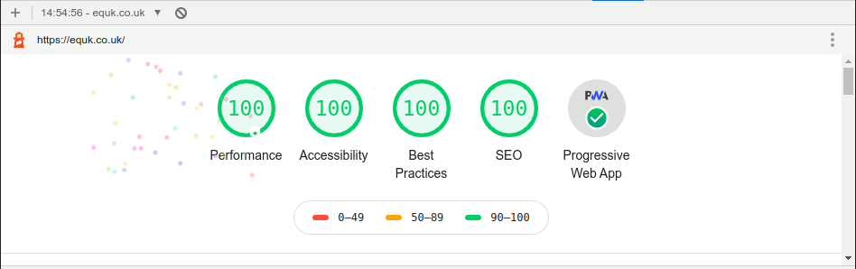

# equk-gatsby

My Personal Blog - [equk.co.uk](https://equk.co.uk)

Built Using Gatsby ⚛️ 📄 🚀

## :warning: not a starter template or theme

This is my own personal blog and shouldn't be used as a starter template or theme.

I have made the site open source and available on github for others to learn from or to contribute improvements.

## main features

- [x] PWA
- [x] Google Workbox Service Worker
- [x] Sitemap
- [x] OpenGraph & Twitter Meta Tags
- [x] Feature Image
- [x] RSS Feed
- [x] Gitalk Comments
- [x] Syntax Highlighting with `prismjs`
- [x] Pagination
- [x] Netlify CMS
- [x] Github Pages
- [x] Netlify
- [x] Subresource Integrity (SRI)

### Google Lighthouse

Performance: 100%    Accessibility: 100%     Best Practices: 100%    SEO: 100%   PWA

## development features

- [x] ESLint with plugins
- [x] Typescript
- [x] `SASS` for styles
- [x] `postcss` with plugins
- [x] `PurgeCSS` on `build`
- [x] `gatsby-image`
- [x] react `hooks`
- [x] `react-helmet`
- [x] GraphQL
- [x] Husky Git Hooks
- [x] Checks js,jsx,ts,tsx pre-commit
- [x] Postbuild script

### eslint config

- [x] typescript
- [x] airbnb
- [x] prettier
- [x] react
- [x] react-hooks

## folder structure

### main content folders

- [x] `content` - posts & pages in markdown + yaml
- [x] `static/media` - images for frontmatter

### favicon generation

- [x] `src/icon/icon.png` - default icon location

### netlify cms

- [x] `static/admin/config.yml` - netlify cms config

# Notes

## Dependencies on Hold

- [ ] `gatsby-plugin-purgecss`: `^5.0.0`
- [ ] `gatsby-plugin-sitemap`: `^3.3.0`
- [ ] `node-sass`: `^5.0.0`
- [ ] `husky`: `^4.3.8`

# Contact

Website: https://equk.co.uk

Twitter: [@equilibriumuk](https://twitter.com/equilibriumuk)

# License

Source Code: MIT License

Content & Media: Copyright

(You are **not** permitted to re-use the content publicly or commercially)