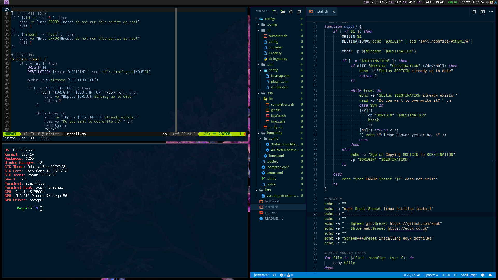

---
slug:
title: "Automated dotfiles"
date: 2019-07-24T10:42:34.564Z
draft: false
author: equilibriumuk
tags:
  - linux
  - github
  - archlinux
image:
---

I decided to automate my dotfiles for working on different systems but didn't want to have symlinks everywhere so reworked an <a href="/2014/04/14/dotfiles-script/" target="_blank" aria-label="go to dotfiles-script" rel="noopener noreferrer">old script I made in 2014 for backing up dotfiles</a>.

This time I thought I'd automate both backup and install making it easier & quicker for clean installs.

The script also makes it possible to automate the install of extensions in Visual Studio Code & Vim.

## My Desktop Setup

I use a tiling WM in linux with dual monitors and have odd numbered desktops on the left monitor & even numbered on the right monitor.

Programs are launched using dmenu ( ctrl + space ).

I've had the same setup <a href="/2014/05/29/switching-to-i3wm/" target="_blank" aria-label="go to switching to i3wm" rel="noopener noreferrer">since 2014</a> and find it a lot faster than the mini game of dragging windows around.



## Script Design

The script copies files as an alternative to having symlinks everywhere.

This allows me to control when I commit config changes to github (there may be times when testing settings etc).

It also means I don't have symlinks across different disk mount points.

```bash
function copy() {
    if [ -f $1 ]; then
        ORIGIN=$1
        DESTINATION=$(echo "$ORIGIN" | sed "s#^\./configs/#$HOME/#")

        mkdir -p $(dirname "$DESTINATION")

        if [ -a "$DESTINATION" ]; then
            if diff "$ORIGIN" "$DESTINATION" >/dev/null; then
                echo -e "$bplus $DESTINATION already up to date"
                return 2
            fi
```

### Install & Backup Features

- [x] create folder structure if required
- [x] prompt before overwriting existing configuration
- [x] check for changes using diff
- [x] cli feedback for each config file
- [x] checks user is not root

### Folder Structure

```bash
.
├── backup.sh
├── install.sh
├── configs/
├── lists/
└── sys/
```

- `configs` contains config files from users `home` directory
- `lists` contains vscode extensions list
- `sys` contains files from linux system (eg: `/etc/`)

## Download

The scripts and my dotfiles can be downloaded from github.

<a class="github" href="https://github.com/equk/dotfiles" aria-label="Download on GitHub" target="_blank" rel="noopener noreferrer"><i class="fa fa-github"></i> Download</a>