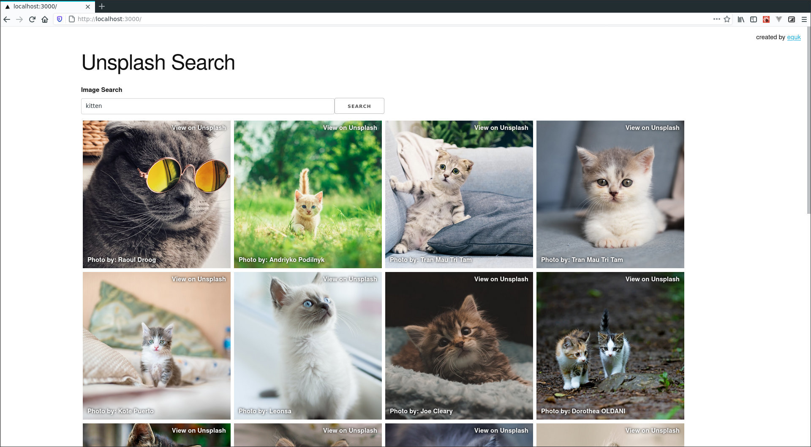
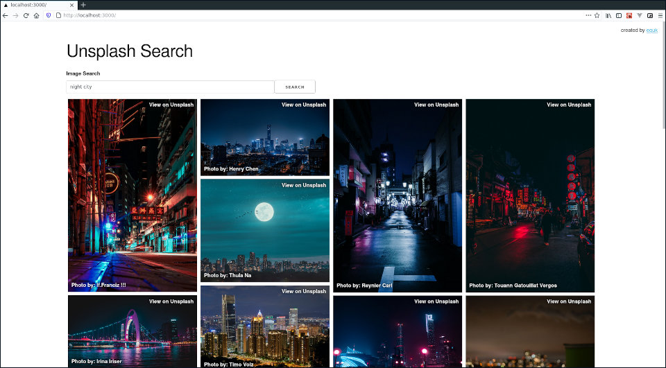

---
slug:
title: "Unsplash Next.js Search"
date: 2021-03-31T11:10:39.806Z
draft: false
author: equilibriumuk
tags:
  - javascript
  - unsplash
  - json
  - api
  - dom
  - react
  - github
  - async
image:
---

<p class="text-center"><br/></p>

This is a working example of a next.js app using state to render an array of images utilizing the virtual DOM.<br/>
The project also uses the `fetch()` api which provides asynchronous requests with the use of promises.<br/>
The design & layout is based on my previous vanillajs project `unsplash-js-search`.<br/>
My <a href="/2018/08/01/unsplash-javascript-search/" target="_blank">blog post for unsplash-js-search</a> has more information regarding design aspects & working with the unsplash api.

## Main Features

- [x] Stateful Components
- [x] Loading Feedback
- [x] Async API Requests
- [x] API Key Seperated Using `.env.local`
- [x] Conditional Rendering
- [x] Virtual DOM



## Requirements

### Getting an API Key

In order to make any requests you will need to <a href="https://unsplash.com/developers" target="_blank">signup to unsplash as a developer</a> & request an API key.

### Adding API Key to App

Add unsplash developer key to `.env.local` file in the base directory of the project.

```bash
NEXT_PUBLIC_API_CLIENTID = "insert-api-key-here";
```

The source for this project is available on github.

<a class="github" href="https://github.com/equk/unsplash-nextjs" aria-label="View on GitHub" target="_blank" rel="noopener noreferrer"><i class="fa fa-github"></i> unsplash-nextjs</a>

---

## Cascading Grid

I decided to improve the look of the image results with a cascading grid which places elements based on vertical space.



This allows the images to be viewed using the original aspect ratio.

*Cascading Grid Feature Added Apr 6, 2021*

The source for this project is available on github.

<a class="github" href="https://github.com/equk/unsplash-nextjs" aria-label="View on GitHub" target="_blank" rel="noopener noreferrer"><i class="fa fa-github"></i> unsplash-nextjs</a>