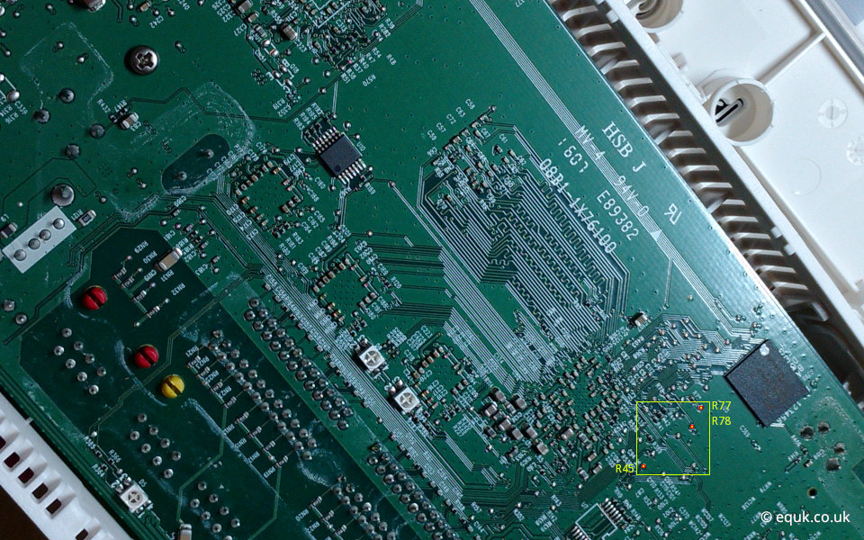

---
slug:
title: "Unlocking Plusnet Hub One"
date: 2022-04-11T09:46:37.554Z
draft: false
author: equilibriumuk
tags:
  - openwrt
  - hardware
  - u-boot
  - linux
  - firmware
image: ../../static/media/images/2022/plusnet_hub_one_top.jpg
---

The Plusnet Hub One is a variation of the BT HomeHub 5a. 
I previously posted a article in 2016: <a href="/2016/10/04/unlocking-bt-homehub-5a/" target="_blank" rel="noopener noreferrer">Unlocking BT HomeHub 5a</a>

_These routers are pretty old now but can be useful as an addition to an existing network or for testing._

## Why Do This?

There are various reasons for doing this, the main is to gain more control over the router allowing you to add more features.

## Hardware Modification

### Requirements

- [ ] Tools to open router
- [ ] Soldering experience
- [ ] Soldering tools

Opening the Plusnet Hub One without breaking the clips takes a lot of patience. 
_See image at top of page for reference ( 2 x clips either side + 4 x clips at top + 2 x clips at bottom corners )_

### Serial UART

Here is a image of the PCB to show the size of the solder points. 
_(the white header on the left is a USB port)_.

Solder the UART points below the flash memory `R77` & `R78` which trace back to SoC VRX268 pins B22 & C23. 
The U-Boot doesn't have bootdelay variable so we also need to solder to `BOOT_SEL2` (`R45`) to enable UART.

Here is a image of the points after soldering (R77, R78, R45).

Connect a serial device to TXD, RXD & GND (R77 is TXD, R78 is RXD, R45 is BOOT_SEL2). 
I used a CH340G USB to Serial adapter. It's also possible to use a <a href="http://pinout.xyz/pinout/uart" target="_blank" rel="noopener noreferrer">Raspberry Pi</a>.

## Software Modification

I recommend reading through the references below to uderstand the process before proceeding.

### Supported Routers

- [x] BT BusinessHub 5a
- [x] Plusnet Hub One
- [x] BT HomeHub 5a

### References

- [ ] <a href="https://github.com/mkresin/BTHH5a-installimage/releases" target="_blank" rel="noopener noreferrer">BTHH5a-installimage on Github</a>
- [ ] <a href="https://openwrt.org/toh/bt/homehub_v5a" target="_blank" rel="noopener noreferrer">BT Home Hub 5.0 Type A on OpenWrt Wiki</a>

### Requirements

- [ ] A modified router to allow UBOOT over UART
- [ ] USB Stick (FAT32)
- [ ] Serial Interface
- [ ] TFTP on `192.168.0.2` serving Install Image

Files

- [ ] LEDE UBoot
- [ ] LEDE Install Image
- [ ] LEDE 17.01.4 sysupgrade
- [ ] OpenWrt sysupgrade

### Modification Steps

Make sure you understand these steps before proceeding.

- [ ] Boot UART (put `BOOT_SEL2` to `GND`)
- [ ] Send UBOOT over USB
- [ ] Boot Install Image from TFTP
- [ ] Backup existing firmware (using `nanddump`)
- [ ] Install LEDE (run `prepare`)
- [ ] Reboot router to LEDE
- [ ] Install OpenWrt using sysupgrade

<article class="message is-danger">
  

    Backup current firmware to a FAT32 formatted USB stick using the install image before writing new firmware. <em>(filesize of backup should be ~128MiB)</em>
  

</article>

#### Related

<i class="fa fa-link"></i>  <a href="/2015/07/13/netgear-wnr2200-openwrt-usb-support/" target="_blank" rel="noopener noreferrer">Netgear wnr2200 OpenWrt USB Support</a> 
<i class="fa fa-link"></i>  <a href="/2016/10/04/unlocking-bt-homehub-5a/" target="_blank" rel="noopener noreferrer">Unlocking BT HomeHub 5a</a>