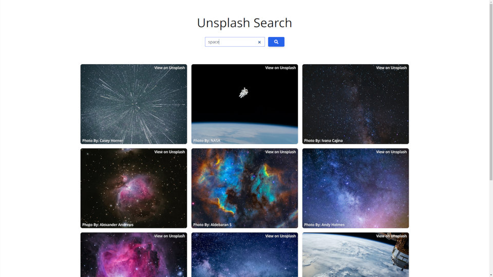

---
slug:
title: "Image Search Using Sveltekit"
date: 2022-10-21T14:38:36.797Z
draft: false
author: equilibriumuk
tags:
  - javascript
  - json
  - api
  - svelte
  - github
  - async
image:
---

<p class="text-center"> </p>

This is a example of a sveltekit app which renders an array of images from the unsplash json api utilizing some features of sveltekit.

## Why Sveltekit

I have followed svelte for a while & like the idea of no virtual DOM.

The sveltekit project is really interesting as it takes a lot of modern tools (eg: Vite HMR) & provides a framework to take advantage of modern features like mixing SSR with CSR & prefetching.

<i class="fa fa-youtube-play yt-red"></i> <a href="https://www.youtube.com/watch?v=AdNJ3fydeao" target="_blank" rel="noopener noreferrer">Rich Harris - Rethinking reactivity (2019)</a><br />
<i class="fa fa-youtube-play yt-red"></i> <a href="https://www.youtube.com/watch?v=860d8usGC0o" target="_blank" rel="noopener noreferrer">Have Single-Page Apps Ruined the Web? (2021)</a><br />
<i class="fa fa-youtube-play yt-red"></i> <a href="https://www.youtube.com/watch?v=uQntFkK8Z54" target="_blank" rel="noopener noreferrer">The Future of Svelte (Interview with Rich Harris)</a><br />
<i class="fa fa-link"></i> <a href="https://svelte.dev/blog/whats-new-in-svelte-september-2022" target="_blank" rel="noopener noreferrer">SvelteKit's new filesystem-based router (Sep 2022)</a><br />

### Svelte Code

The main code is pretty simple & the <a href="https://svelte.dev/docs" aria-label="Svelte Docs" target="_blank" rel="noopener noreferrer">svelte docs</a> have some really good examples.

Import variables from `.env` using <a href="https://kit.svelte.dev/docs/modules#$env-dynamic-public" aria-label="Svelte Docs" target="_blank" rel="noopener noreferrer">sveltekit $env/dynamic/public module</a>

```js
import { env as public_env } from '$env/dynamic/public';
```

Start with a fetch request in JS which returns json

```js
async function fetchImages(searchTerm = 'neon') {
  const imageRes = await fetch(`${api_url}&query=${searchTerm}`);
  const imageData = await imageRes.json();
  return imageData.results;
}
```

Use a form (with event handler) which returns `searchTerm`

```js
<form on:submit|preventDefault={handleSubmit}>
  <input bind:value={searchTerm} type="text" />
</form>
```

Use an event handler on submit of `searchTerm`

```js
function handleSubmit() {
  searchImages = fetchImages(searchTerm);
}
```

Use svelte logic within page to return a image component for each result in array

```js
{#await searchImages}
  <p>searching ...</p>
{:then images}
  {#each images as image}
        
  {/each}
{:catch error}
  <p>ERROR: <span>{error}</span></p>
{/await}
```

This demonstrates how easy svelte makes it to create dynamic webapps.

I previously made a similar <a href="/2018/08/01/unsplash-javascript-search/" target="_blank">example project using vanillajs in 2018</a> to show you can do a lot with DOM manipulation & no virtual DOM.

## Main Features

- [x] Async API Requests
- [x] Loading Feedback
- [x] API Key Seperated Using `.env`
- [x] Responsive Styles ( tailwindcss )



## Requirements

### Getting an API Key

In order to make any requests you will need to <a href="https://unsplash.com/developers" target="_blank">signup to unsplash as a developer</a> & request an API key.

### Adding API Key to App

Add unsplash developer key to `.env` file in the base directory of the project.

```bash
PUBLIC_API_CLIENTID = "insert-api-key-here";
```

The source for this project is available on github.

<a class="github" href="https://github.com/equk/unsplash-svkit" aria-label="View on GitHub" target="_blank" rel="noopener noreferrer"><i class="fa fa-github"></i> unsplash-svkit</a>

<p class="text-right"><em>References: <a href="https://developer.mozilla.org/en-US/docs/Web/API/Fetch_API/Using_Fetch" target="_blank">fetch()</a> / <a href="https://kit.svelte.dev/" target="_blank">sveltekit</a> / <a href="https://vitejs.dev/" target="_blank">vite</a> / <a href="https://developer.mozilla.org/en-US/docs/Web/JavaScript/Reference/Global_Objects/Promise" target="_blank">promises</a> / <a href="https://unsplash.com/developers" target="_blank">Unsplash API</a></em></p>
