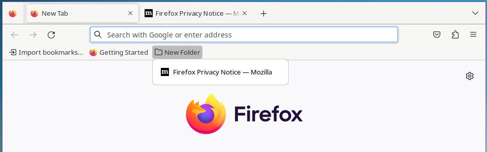
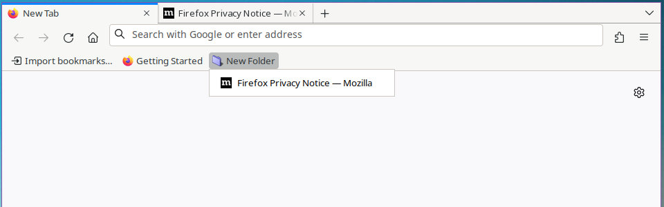

---
slug:
title: "Firefox Profiles In Windows Rework"
date: 2023-03-29T14:19:34.928Z
draft: false
author: equilibriumuk
tags:
  - github
  - firefox
  - javascript
  - powershell
image: ../../static/media/images/2018/09/mozilla_header.jpg
---

After moving back to using Firefox I noticed my old windows firefox profile powershell script needed updating.

*The script previously used hardlinks due to the way Windows 10 handled pinning of applications.*

Fortunately this was fixed so hardlinks are no longer required.

This also means the script no longer requires Administrator rights as it only writes to user owned files.

## 🦊 ffox_profiles_win

Firefox profiles with security presets & userchrome styles on windows

## Summary

The purpose of this project is to provide a way to create new firefox profiles with security & privacy settings already preset.

It also includes some style customizations using `userChrome.css`.

## Why Make This Script?

*Mozilla Firefox has a profile manager in windows but doesn't create shortcuts for each profile & expects users to use the profile launcher to select each time.*

This script creates profiles & shortcuts for each making it easier for users. 
It also uses the same preset settings & userChrome styles for each.

## Usage

Clone or download the repo

<a class="github" href="https://github.com/equk/ffox_profiles_win" aria-label="View on GitHub" target="_blank" rel="noopener noreferrer"><i class="fa fa-github"></i> ffox_profiles_win</a>

Edit `ffox_profiles.ps1` & add profiles you require to the `profiles` array

Optionally you may also want to change the `profilepath` variable (default is $mydocs\ffox_profiles)

Run the script

*The script creates shortcuts & opens folder so u can pin them*

Pin shortcuts for each profile to the start menu / taskbar

## Features

Creation of new profiles with:

- [x] Security & Privacy Related Settings Pre-Set
- [x] Find At Top Of Screen
- [x] RAM Caching Enabled
- [x] Bookmark Bar Spacing
- [x] Disable Ugly `urlbar` Zoom (firefox >75)
- [x] Disable Ugly Drop Shadow On Search
- [x] Disable Search Suggestions
- [x] Disable Sponsored Suggestions
- [x] Restore Old Square Tabs
- [x] Smaller Tab Density
- [x] Cleaner Image Context Menu
- [x] Smaller Bookmark Menu Spacing
- [x] Custom Folder Icons
- [x] No Rounded Edges in Dropdown Menu

With this script you can have a pinned shortcut on the start menu & the taskbar for each profile.

## Screenshots

### userChrome Comparison

Here is a comparison to show the changes made with userChrome styles.

#### Firefox Default

#### Firefox userChrome Applied

## Related

📝 <a href="/2023/03/29/firefox-in-2023/" target="_blank">Mar 29, 2023 - Firefox in 2023</a> | 📝 <a href="/2018/09/19/firefox-profiles-in-windows/" target="_blank">Sep 19, 2018 - Firefox Profiles In Windows</a>